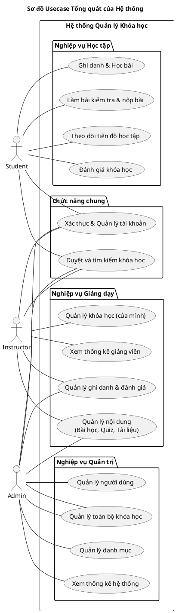
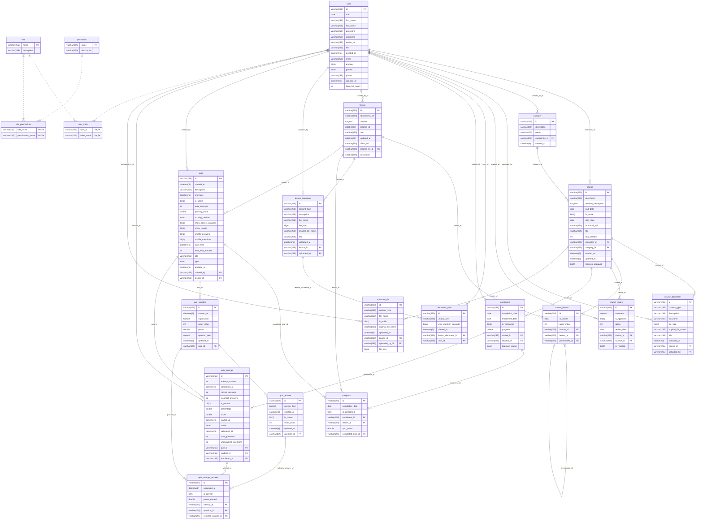
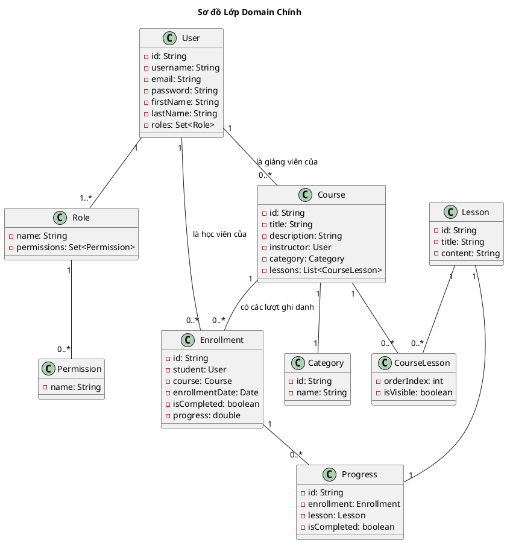
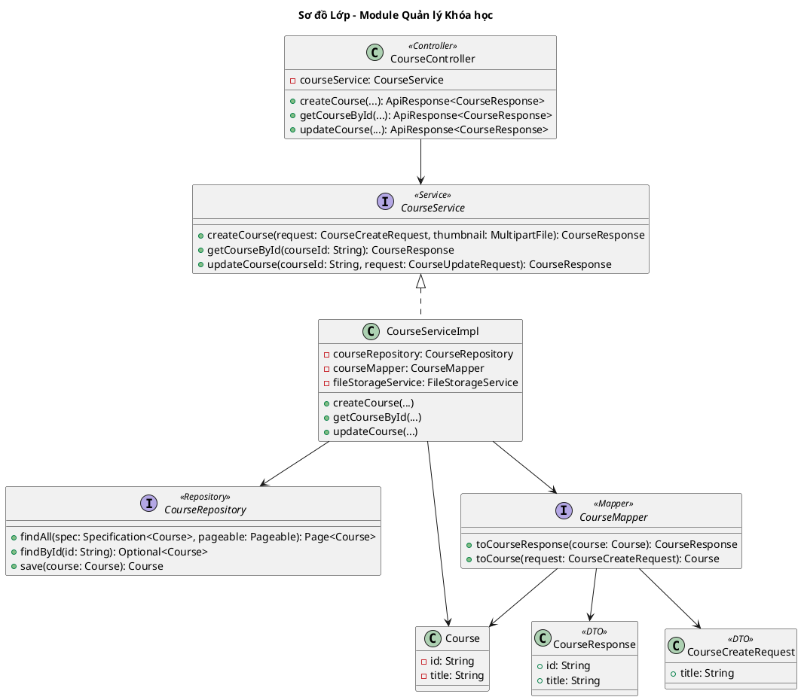
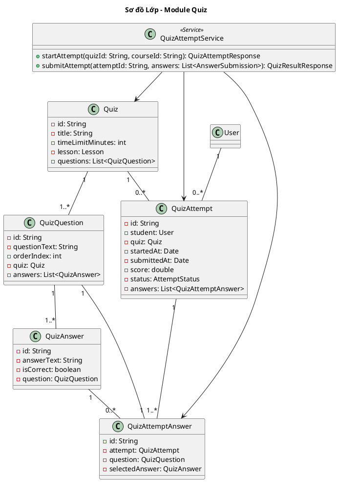

# Báo cáo chi tiết về Backend - Hệ thống Quản lý Khóa học Trực tuyến

### 1. Giới thiệu bài toán

**Phát biểu bài toán và động lực thực hiện dự án**

Dự án tập trung vào việc xây dựng một hệ thống backend mạnh mẽ và linh hoạt cho một nền tảng quản lý khóa học trực tuyến (Online Course Management System). Động lực chính xuất phát từ nhu cầu ngày càng tăng về giáo dục trực tuyến, đòi hỏi một hệ thống có khả năng quản lý hiệu quả các khóa học, người dùng, nội dung học tập và tương tác giữa người dạy và người học.

**Nhu cầu/mục tiêu cần phải đáp ứng**

Hệ thống cần đáp ứng các nhu cầu chính sau đây, tương ứng với các vai trò người dùng khác nhau:

*   **Học viên (Student):** Đăng ký, đăng nhập, quản lý thông tin cá nhân. Tìm kiếm, duyệt và đăng ký tham gia các khóa học. Học các bài học, theo dõi tiến độ học tập của bản thân. Đánh giá và để lại nhận xét cho các khóa học đã tham gia.
*   **Giảng viên (Instructor):** Tạo và quản lý toàn diện các khóa học của mình (thêm, sửa, xóa nội dung, thông tin khóa học). Tải lên và quản lý tài liệu cho các bài học. Theo dõi danh sách học viên trong khóa học. Tạo và quản lý các bài kiểm tra (quiz).
*   **Quản trị viên (Admin):** Quản lý toàn bộ hệ thống, bao gồm quản lý tài khoản người dùng (khóa, mở khóa), quản lý tất cả các khóa học và danh mục. Xem các thống kê tổng quan về hoạt động của hệ thống.

### 2. Phân tích yêu cầu bài toán và các nghiên cứu liên quan

#### Phân tích yêu cầu bài toán

Từ mô tả tổng quan, chúng ta có thể phân rã các yêu cầu thành hai nhóm chính:

*   **Yêu cầu chức năng (Functional Requirements):**
    *   **Authentication & Authorization:** Cung cấp cơ chế đăng ký, đăng nhập an toàn (sử dụng JWT). Phải có khả năng phân quyền chi tiết cho 3 vai trò: Student, Instructor, và Admin.
    *   **Quản lý Khóa học:** Instructor phải có đầy đủ các quyền tạo, đọc, cập nhật, xóa (CRUD) trên các khóa học và nội dung liên quan (bài học, tài liệu). Hệ thống phải lưu trữ được các thông tin đa dạng của khóa học.
    *   **Tương tác của Học viên:** Student có thể tìm kiếm, đăng ký khóa học, theo dõi tiến độ hoàn thành, và đưa ra đánh giá (rating) cũng như nhận xét.
    *   **Quản trị hệ thống:** Admin có quyền cao nhất, có khả năng xem các số liệu thống kê tổng quan và quản lý toàn bộ người dùng, khóa học trên hệ thống.

*   **Yêu cầu phi chức năng (Non-functional Requirements):**
    *   **Công nghệ:** Hệ thống phải được xây dựng bằng Spring Boot, sử dụng JPA/Hibernate cho tầng truy cập dữ liệu và kết nối với CSDL quan hệ (MySQL).
    *   **API:** Cung cấp giao diện RESTful API. Tích hợp Swagger UI để việc kiểm thử và tài liệu hóa API trở nên dễ dàng.
    *   **Kiến trúc:** Khuyến khích áp dụng các mẫu kiến trúc tốt như Clean Architecture hoặc Hexagonal Architecture để tăng tính dễ bảo trì và mở rộng.

#### Làm rõ các kết quả tìm hiểu từ các giải pháp/nghiên cứu khác liên quan đến bài toán

Hệ thống được xây dựng thuộc loại Hệ thống Quản lý Học tập (Learning Management System - LMS), một lĩnh vực đã có nhiều giải pháp phổ biến và thành công như Moodle, Coursera, Udemy. Việc nghiên cứu các hệ thống này cho thấy một số mẫu thiết kế và công nghệ chung đã được chứng minh là hiệu quả:

*   **Kiến trúc Backend:** Hầu hết các hệ thống hiện đại đều sử dụng kiến trúc phân lớp (Layered Architecture) hoặc các biến thể tiên tiến hơn như Clean/Hexagonal Architecture. Điều này giúp tách biệt logic nghiệp vụ khỏi các thành phần cơ sở hạ tầng (như database, web framework), làm cho hệ thống dễ dàng thay đổi và kiểm thử.
*   **Giao tiếp API:** RESTful API là tiêu chuẩn vàng để giao tiếp giữa backend và các client (web, mobile), mang lại sự linh hoạt và độc lập trong phát triển.
*   **Cơ sở dữ liệu:** CSDL quan hệ (như PostgreSQL, MySQL) thường là lựa chọn ưu tiên cho các LMS do khả năng quản lý hiệu quả các mối quan hệ phức tạp và lồng nhau giữa người dùng, khóa học, bài học, tiến độ, và các thực thể khác.
*   **Cơ chế xác thực:** JSON Web Token (JWT) là lựa chọn phổ biến cho các RESTful API vì tính stateless, giúp hệ thống dễ dàng mở rộng theo chiều ngang (horizontal scaling).

#### Các điểm đạt được/chưa đạt được của các giải pháp/nghiên cứu đã tìm hiểu

*   **Điểm đạt được:** Dự án đã học hỏi và áp dụng thành công các công nghệ và kiến trúc đã được kiểm chứng từ các giải pháp lớn. Cụ thể, hệ thống đã xây dựng được một nền tảng vững chắc với kiến trúc phân lớp rõ ràng, cung cấp RESTful API và sử dụng JWT để bảo mật, đáp ứng đầy đủ các yêu cầu cốt lõi của một LMS được đặt ra trong bài toán.
*   **Điểm chưa đạt được (Phạm vi dự án):** Các giải pháp LMS thương mại quy mô lớn thường có các chức năng phức tạp hơn mà dự án này chưa đề cập tới do giới hạn về phạm vi. Ví dụ:
    *   **Tích hợp thanh toán:** Kết nối với các cổng thanh toán (Stripe, PayPal) để bán khóa học.
    *   **Tuân thủ chuẩn E-learning:** Hỗ trợ các chuẩn như SCORM, xAPI để có thể nhập/xuất nội dung học liệu.
    *   **Xử lý Video nâng cao:** Hệ thống streaming, chuyển mã (transcoding) video để tối ưu cho nhiều thiết bị.
    *   **Phân tích học tập (Learning Analytics):** Các công cụ phân tích sâu về hành vi và kết quả học tập của học viên.
    Những điểm này có thể được xem là hướng phát triển và mở rộng tiềm năng cho dự án trong tương lai.

### 3. Giải pháp đề xuất

#### Tổng quan giải pháp đề xuất và các điểm cải tiến

Để đáp ứng các yêu cầu trên, giải pháp được đề xuất là xây dựng hệ thống bằng **Spring Boot**, kết hợp với hệ sinh thái phong phú của Spring để có một nền tảng mạnh mẽ, bảo mật và có khả năng mở rộng.

*   **Nền tảng chính:** Spring Boot được chọn làm frameworkหลัก do khả năng phát triển nhanh, cấu hình tự động thông minh và được cộng đồng hỗ trợ rộng rãi.
*   **Điểm nổi bật và cải tiến trong cách triển khai:** Thay vì chỉ triển khai các tính năng một cách cơ bản, dự án này tập trung vào chất lượng và sự hoàn thiện của mã nguồn, thể hiện qua các điểm sau:
    *   **Kiến trúc rõ ràng:** Tuân thủ nghiêm ngặt cấu trúc phân lớp, tách biệt rõ ràng các trách nhiệm của `Controller`, `Service`, và `Repository`.
    *   **Tối ưu hóa việc truyền dữ liệu:** Sử dụng mẫu thiết kế **Data Transfer Object (DTO)** kết hợp với thư viện **MapStruct** để tự động hóa việc ánh xạ. Giải pháp này vừa đảm bảo an toàn (không lộ cấu trúc Entity ra API), vừa linh hoạt (tùy chỉnh được dữ liệu trả về cho từng API), vừa giảm thiểu đáng kể mã lặp đi lặp lại.
    *   **API linh hoạt và mạnh mẽ:** Triển khai cơ chế tìm kiếm và lọc động bằng **JPA Specification**. Điều này cho phép client có thể kết hợp nhiều tiêu chí lọc khác nhau trên API mà không cần phải định nghĩa trước các phương thức truy vấn cố định ở backend.
    *   **Bảo mật toàn diện:** Hệ thống không chỉ xác thực bằng JWT mà còn triển khai cơ chế xử lý logout cho token (vốn stateless) thông qua bảng `invalidated_token`, và có nền tảng để chống vét cạn mật khẩu (`loginFailCount`).
    *   **Xử lý lỗi chuyên nghiệp:** Xây dựng một trình xử lý lỗi toàn cục (`GlobalExceptionHandler` với `@RestControllerAdvice`) để đảm bảo tất cả các lỗi phát sinh trong ứng dụng đều được xử lý một cách nhất quán và trả về định dạng JSON thân thiện cho client.

#### Chi tiết các giải pháp kỹ thuật và công nghệ áp dụng

Dưới đây là chi tiết cách các công nghệ và giải pháp được áp dụng để giải quyết từng yêu cầu nghiệp vụ:

**1. Kiến trúc tổng thể**

*   **Công nghệ:** Spring Boot, Spring Data JPA, Hibernate.
*   **Giải pháp:** Hệ thống được xây dựng dựa trên **kiến trúc phân lớp (Layered Architecture)**.
    *   **`controller`:** Tầng giao tiếp với bên ngoài, chịu trách nhiệm tiếp nhận các HTTP request, xác thực đầu vào cơ bản (`@Valid`) và gọi các `service` tương ứng để xử lý.
    *   **`service`:** Tầng chứa logic nghiệp vụ chính của ứng dụng. Đây là nơi xử lý tất cả các quy tắc và quy trình của bài toán, điều phối hoạt động giữa các `repository`. Các phương thức trong tầng này được đánh dấu `@Transactional` để đảm bảo tính toàn vẹn dữ liệu.
    *   **`repository`:** Tầng truy cập dữ liệu, sử dụng Spring Data JPA để tương tác với cơ sở dữ liệu.
    *   **`entity`:** Các lớp Java được ánh xạ tới các bảng trong cơ sở dữ liệu bằng JPA.
    *   **`dto` & `mapper`:** Sử dụng DTO và MapStruct để chuyển đổi dữ liệu an toàn giữa các tầng.

**2. Authentication & Authorization (Xác thực & Phân quyền)**

*   **Công nghệ:** Spring Security, JSON Web Token (JWT).
*   **Giải pháp:**
    *   **Luồng xác thực:** Khi người dùng đăng nhập, `AuthenticationService` sẽ xác thực thông tin. Nếu thành công, một JWT chứa thông tin người dùng và quyền hạn sẽ được tạo, ký bằng private key và trả về.
    *   **Luồng phân quyền:** Với mỗi request, một `JwtAuthenticationFilter` tùy chỉnh sẽ trích xuất và giải mã JWT từ header `Authorization` bằng public key. Thông tin người dùng sau đó được nạp vào `SecurityContext` của Spring. Tầng controller sử dụng các annotation `@PreAuthorize` để kiểm tra quyền truy cập dựa trên thông tin này.
    *   **Đăng xuất:** Khi người dùng đăng xuất, ID của JWT sẽ được lưu vào bảng `invalidated_token`. Filter sẽ từ chối các token có trong bảng này, đây là một cách hiệu quả để vô hiệu hóa JWT.

**3. Quản lý File và Tìm kiếm động**

*   **Công nghệ:** Spring Boot, JPA Specification.
*   **Giải pháp:**
    *   **Quản lý File:** `FileStorageService` xử lý việc lưu file tải lên vào thư mục cục bộ, đổi tên file bằng UUID để tránh trùng lặp, và lưu metadata vào CSDL.
    *   **Tìm kiếm và Lọc động:** `UserSpecification` và `CourseSpecification` được sử dụng để xây dựng các truy vấn `WHERE` động dựa trên các tham số từ URL của request. Giải pháp này giúp các API `GET All` trở nên cực kỳ linh hoạt.

**4. Phân tích Chi tiết Nghiệp vụ & Usecase

Phần này sẽ đi sâu vào các luồng nghiệp vụ chính của hệ thống, đặc biệt là các nghiệp vụ xoay quanh `Course`.

#### 4.0. Sơ đồ Usecase Tổng quát

Sơ đồ dưới đây mô tả một cách tổng quan các chức năng chính của hệ thống và sự tương tác của ba vai trò cốt lõi: Student, Instructor và Admin.



Phần này sẽ đi sâu vào các luồng nghiệp vụ chính của hệ thống, đặc biệt là các nghiệp vụ xoay quanh `Course`.

#### 4.1. Tổng quan các Nghiệp vụ liên quan đến Khóa học

Dựa trên phân tích các service, hệ thống xử lý 4 nhóm nghiệp vụ chính liên quan đến một khóa học:

*   **Quản lý Khóa học (CourseService):** Xử lý vòng đời của một khóa học, từ tạo, cập nhật, xóa đến lấy thông tin. Điểm đặc biệt của service này là logic phân quyền truy cập động, đảm bảo người dùng chỉ thấy được dữ liệu mà họ được phép.
*   **Quản lý Bài học trong Khóa học (CourseLessonService):** Quản lý mối quan hệ giữa khóa học và bài học. Cho phép giảng viên thêm, xóa, sắp xếp thứ tự các bài học và thiết lập các điều kiện tiên quyết (prerequisite). Service này cũng chịu trách nhiệm đồng bộ lại tổng số bài học của khóa học và cập nhật tiến độ của học viên khi cấu trúc khóa học thay đổi.
*   **Quản lý Tài liệu Khóa học (CourseDocumentService):** Cho phép giảng viên đính kèm các tài liệu (PDF, ZIP,...) cho toàn bộ khóa học. Chỉ những học viên đã đăng ký, giảng viên và quản trị viên mới có quyền truy cập và tải về các tài liệu này.
*   **Quản lý Đánh giá Khóa học (CourseReviewService):** Cho phép học viên đã hoàn thành khóa học để lại đánh giá (rating và bình luận). Các đánh giá này cần được giảng viên hoặc quản trị viên phê duyệt trước khi hiển thị công khai.

#### 4.2. Usecase và Sơ đồ Tuần tự (Sequence Diagram)

Dưới đây là phân tích một số usecase tiêu biểu và sơ đồ tuần tự minh họa.

##### 4.2.1. Usecase: Giảng viên tạo một Khóa học mới

*   **Mô tả:** Một giảng viên (`INSTRUCTOR`) tạo một khóa học mới bằng cách cung cấp các thông tin cần thiết (tiêu đề, mô tả, danh mục) và một ảnh thumbnail. Hệ thống sẽ xác thực thông tin, kiểm tra quyền, lưu thông tin khóa học, lưu trữ ảnh thumbnail và trả về thông tin khóa học đã tạo.
*   **Sơ đồ tuần tự:**
    ```plantuml
    @startuml
    actor Instructor
    boundary "CourseController" as Boundary
    control "CourseService" as Control
    control "FileStorageService" as FileControl
    entity "Repositories" as EntityDb

    activate Instructor
    Instructor -> Boundary: POST /courses\n(courseJson, thumbnailFile)
    activate Boundary

    Boundary -> Control: createCourse(request, thumbnail)
    activate Control

    Control -> EntityDb: findByCategoryName(name)
    activate EntityDb
    EntityDb --> Control: category
    deactivate EntityDb

    Control -> EntityDb: existsByTitle(title)
    activate EntityDb
    EntityDb --> Control: false
    deactivate EntityDb

    Control -> Control: Get current user (Instructor)
    Control -> EntityDb: findByUsername(username)
    activate EntityDb
    EntityDb --> Control: instructorUser
    deactivate EntityDb

    alt thumbnailFile is present
        Control -> FileControl: storeFile(thumbnailFile)
        activate FileControl
        FileControl --> Control: storedFileName
        deactivate FileControl
    end

    Control -> EntityDb: courseRepository.save(course)
    activate EntityDb
    EntityDb --> Control: savedCourse
    deactivate EntityDb

    Control --> Boundary: courseResponse
    deactivate Control

    Boundary --> Instructor: ApiResponse(courseResponse)
    deactivate Boundary
    deactivate Instructor
    @enduml
    ```

##### 4.2.2. Usecase: Học viên xem chi tiết một Khóa học

*   **Mô tả:** Một người dùng (có thể là khách, học viên) truy cập trang chi tiết của một khóa học. Hệ thống sẽ kiểm tra quyền của người dùng và trạng thái của khóa học để quyết định lượng thông tin trả về.
*   **Sơ đồ tuần tự:**
    ```plantuml
    @startuml
    actor User
    boundary "CourseController" as Boundary
    control "CourseService" as Control
    entity "CourseRepository" as CourseEntity
    entity "CourseReviewRepository" as ReviewEntity
    
    activate User
    User -> Boundary: GET /courses/{courseId}
    activate Boundary

    Boundary -> Control: getCourseById(courseId)
    activate Control

    Control -> CourseEntity: findById(courseId)
    activate CourseEntity
    CourseEntity --> Control: course
    deactivate CourseEntity

    Control -> Control: getAuthentication() & checkAccessLevel(course, auth)
    Control --> Control: accessLevel = BASIC_ACCESS

    Control -> Control: mapCourseToResponse(course, false)
    Control -> ReviewEntity: findAverageRating(courseId)
    activate ReviewEntity
    ReviewEntity --> Control: avgRating
    deactivate ReviewEntity

    Control -> ReviewEntity: countReviews(courseId)
    activate ReviewEntity
    ReviewEntity --> Control: totalReviews
    deactivate ReviewEntity

    Control --> Boundary: courseResponse (basic info)
    deactivate Control
    
    Boundary --> User: ApiResponse(courseResponse)
    deactivate Boundary
    deactivate User
    @enduml
    ```

##### 4.2.3. Usecase: Giảng viên thêm một Bài học vào Khóa học

*   **Mô tả:** Giảng viên thêm một bài học đã có sẵn vào một khóa học, xác định thứ tự và điều kiện tiên quyết. Hệ thống sẽ cập nhật cấu trúc khóa học, đồng bộ lại `totalLessons` và cập nhật lại tiến độ (`progress`) của tất cả học viên đang theo học.
*   **Sơ đồ tuần tự:**
    ```plantuml
    @startuml
    actor Instructor
    boundary "CourseLessonController" as Boundary
    control "CourseLessonService" as CLControl
    control "ProgressService" as ProgControl
    entity "Repositories" as EntityDb

    activate Instructor
    Instructor -> Boundary: POST /courses/{id}/lessons\n(lessonId, orderIndex, ...)
    activate Boundary
    
    Boundary -> CLControl: addLessonToCourse(courseId, request)
    activate CLControl
    
    CLControl -> EntityDb: findCourseById(courseId)
    CLControl -> EntityDb: findLessonById(lessonId)
    CLControl -> CLControl: checkCoursePermission()
    
    CLControl -> EntityDb: courseLessonRepo.save(courseLesson)
    activate EntityDb
    EntityDb --> CLControl: savedCourseLesson
    deactivate EntityDb
    
    CLControl -> CLControl: syncCourseTotalLessons(course)
    note right: Cập nhật Course.totalLessons
    
    CLControl -> EntityDb: enrollmentRepo.findByCourse(course)
    activate EntityDb
    EntityDb --> CLControl: enrollments
    deactivate EntityDb
    
    loop for each enrollment
        CLControl -> ProgControl: recalculateAndSaveEnrollmentProgress(enrollment)
        activate ProgControl
        ProgControl --> CLControl
        deactivate ProgControl
    end
    
    CLControl --> Boundary: courseLessonResponse
    deactivate CLControl
    
    Boundary --> Instructor: ApiResponse
    deactivate Boundary
    deactivate Instructor
    @enduml
    ```

##### 4.2.4. Usecase: Học viên gửi Đánh giá cho Khóa học

*   **Mô tả:** Một học viên đã ghi danh và hoàn thành khóa học có thể gửi đánh giá (rating và bình luận). Hệ thống kiểm tra điều kiện (đã hoàn thành, chưa đánh giá) trước khi lưu đánh giá ở trạng thái "chờ phê duyệt".
*   **Sơ đồ tuần tự:**
    ```plantuml
    @startuml
    actor Student
    boundary "CourseReviewController" as Boundary
    control "CourseReviewService" as Control
    entity "Repositories" as EntityDb

    activate Student
    Student -> Boundary: POST /courses/{id}/reviews\n(rating, comment)
    activate Boundary

    Boundary -> Control: createReview(request, courseId)
    activate Control

    Control -> Control: Get current user (Student)
    Control -> EntityDb: findByUsername()
    activate EntityDb
    EntityDb --> Control: studentUser
    deactivate EntityDb

    Control -> EntityDb: findCourseById(courseId)
    activate EntityDb
    EntityDb --> Control: course
    deactivate EntityDb

    Control -> EntityDb: findEnrollment(studentId, courseId)
    activate EntityDb
    EntityDb --> Control: enrollment
    deactivate EntityDb

    alt enrollment is not completed
        Control --> Boundary: Exception (CANNOT_REVIEW)
        Boundary --> Student: ErrorResponse
        destroy Control
        destroy Boundary
    end
    
    Control -> EntityDb: existsReview(studentId, courseId)
    activate EntityDb
    EntityDb --> Control: false
    deactivate EntityDb

    Control -> EntityDb: reviewRepository.save(review)
    note right: review.isApproved = false
    activate EntityDb
    EntityDb --> Control: savedReview
    deactivate EntityDb
    
    Control --> Boundary: reviewResponse
    deactivate Control

    Boundary --> Student: ApiResponse(reviewResponse)
    deactivate Boundary
    deactivate Student
    @enduml
    ```

#### 4.3. Nghiệp vụ Quản lý Bài học (Lesson)

*   **Tổng quan:** `Lesson` là một thực thể độc lập, có thể được tái sử dụng trong nhiều khóa học khác nhau. Giảng viên tạo ra các bài học, sau đó thêm chúng vào các khóa học thông qua bảng trung gian `CourseLesson`.
*   **Các chức năng chính:**
    *   **CRUD cho `Lesson`:** Giảng viên/Admin có thể tạo, sửa, xóa các bài học. Một bài học không thể bị xóa nếu nó đang được sử dụng trong ít nhất một khóa học.
    *   **Phân quyền truy cập:** Logic phân quyền cho `Lesson` cũng rất chi tiết. Người dùng chỉ có thể xem nội dung đầy đủ của một bài học nếu họ là Admin, Giảng viên, hoặc là Học viên đã đăng ký một khóa học có chứa bài học đó. Nếu không, họ chỉ thấy được thông tin cơ bản như tiêu đề.
    *   **Thống kê:** Cung cấp API để thống kê kết quả làm bài quiz của một bài học trong bối cảnh một khóa học cụ thể, giúp giảng viên theo dõi hiệu quả.

*   **Usecase: Giảng viên tạo một Bài học mới**
    *   **Mô tả:** Giảng viên tạo một bài học mới với tiêu đề, nội dung... Bài học này sau đó có thể được thêm vào nhiều khóa học khác nhau.
    *   **Sơ đồ tuần tự:**
        ```plantuml
        @startuml
        actor Instructor
        boundary "LessonController" as Boundary
        control "LessonService" as Control
        entity "LessonRepository" as EntityDb
        
        activate Instructor
        Instructor -> Boundary: POST /lessons\n(title, content, ...)
        activate Boundary
        
        Boundary -> Control: createLesson(request)
        activate Control
        
        Control -> Control: Get current user (Instructor)
        Control -> EntityDb: lessonRepository.save(lesson)
        activate EntityDb
        EntityDb --> Control: savedLesson
        deactivate EntityDb
        
        Control --> Boundary: lessonResponse
        deactivate Control
        
        Boundary --> Instructor: ApiResponse(lessonResponse)
        deactivate Boundary
        deactivate Instructor
        @enduml
        ```

#### 4.4. Nghiệp vụ Quản lý Kiểm tra (Quiz)

*   **Tổng quan:** Đây là một trong những module phức tạp nhất. Mỗi bài học chỉ có thể có một bài kiểm tra (`1-1 relationship`). Hệ thống quản lý toàn bộ vòng đời của một bài kiểm tra, từ khâu tạo câu hỏi, cho phép học viên làm bài, đến khi chấm điểm và thống kê.
*   **Các chức năng chính:**
    *   **Tạo Quiz và Câu hỏi:** Giảng viên có thể tạo `Quiz` với nhiều thiết lập (thời gian làm bài, số lần làm lại, phương pháp tính điểm...). Sau đó, họ thêm các `QuizQuestion` (câu hỏi) và `QuizAnswer` (câu trả lời) vào quiz.
    *   **Học viên làm bài:** Khi học viên bắt đầu làm bài, một bản ghi `QuizAttempt` được tạo ra. Các câu trả lời của học viên được lưu trong `QuizAttemptAnswer`.
    *   **Chấm điểm:** Khi học viên nộp bài, hệ thống sẽ chấm điểm và trả về kết quả.
    *   **Phân quyền:** Tương tự các module khác, việc xem chi tiết quiz, xem đáp án đúng, hay xem kết quả của người khác đều được phân quyền chặt chẽ. Học viên chỉ có thể xem quiz dưới dạng "đề bài" (không có đáp án).

*   **Usecase: Học viên làm bài Kiểm tra**
    *   **Mô tả:** Học viên bắt đầu một lượt làm bài kiểm tra. Hệ thống tạo một `QuizAttempt`, sau đó học viên gửi các câu trả lời của mình. Khi nộp bài, hệ thống sẽ chấm điểm và trả về kết quả.
    *   **Sơ đồ tuần tự:**
        ```plantuml
        @startuml
        actor Student
        boundary "QuizAttemptController" as Boundary
        control "QuizAttemptService" as Control
        entity "Repositories" as EntityDb
        
        activate Student
        Student -> Boundary: POST /attempts/start\n(quizId, courseId)
        note right: Bắt đầu làm bài
        activate Boundary
        
        Boundary -> Control: startAttempt(request)
        activate Control
        
        Control -> EntityDb: findQuizById()
        Control -> EntityDb: findEnrollment()
        Control -> Control: check permission & attempts left
        
        Control -> EntityDb: attemptRepo.save(newAttempt)
        activate EntityDb
        EntityDb --> Control: savedAttempt
        deactivate EntityDb
        
        Control --> Boundary: attemptResponse (without answers)
        deactivate Control
        
        Boundary --> Student: ApiResponse(attemptResponse)
        deactivate Boundary
        
        Student -> Boundary: POST /attempts/{id}/submit\n([questionId, answerId], ...)
        note right: Nộp bài
        activate Boundary
        
        Boundary -> Control: submitAttempt(attemptId, answers)
        activate Control
        
        Control -> EntityDb: findAttemptById(attemptId)
        Control -> Control: calculateScore(attempt, answers)
        note right: Chấm điểm, tính toán kết quả
        
        Control -> EntityDb: attemptRepo.save(completedAttempt)
        Control -> EntityDb: progressRepo.update()
        
        Control --> Boundary: resultResponse
        deactivate Control
        
        Boundary --> Student: ApiResponse(resultResponse)
        deactivate Boundary
        deactivate Student
        @enduml
        ```

#### 4.5. Nghiệp vụ Quản lý Tài liệu (Document Management)

*   **Tổng quan:** Hệ thống cho phép Giảng viên tải lên các tài liệu đính kèm cho từng bài học cụ thể (`LessonDocument`). Nghiệp vụ này tách biệt với tài liệu của toàn khóa học (`CourseDocument`). Việc truy cập và tải tài liệu được phân quyền chặt chẽ.
*   **Sơ đồ Usecase:**
    ```plantuml
    @startuml
    left to right direction
    actor "Instructor" as I
    actor "Student" as S

    rectangle "Quản lý Tài liệu Bài học" {
      I -- (Tải tài liệu lên)
      I -- (Xóa tài liệu)
      S -- (Xem danh sách tài liệu)
      S -- (Tải tài liệu về)
    }
    @enduml
    ```
*   **Usecase: Giảng viên tải tài liệu cho Bài học**
    *   **Mô tả:** Giảng viên chọn một bài học và tải lên một tệp tin (ví dụ: PDF, ZIP). Hệ thống sẽ lưu trữ tệp tin này và liên kết nó với bài học.
    *   **Sơ đồ tuần tự:**
        ```plantuml
        @startuml
        actor Instructor
        boundary "LessonDocumentController" as Boundary
        control "LessonDocumentService" as Control
        control "FileStorageService" as FileControl
        entity "Repositories" as EntityDb

        activate Instructor
        Instructor -> Boundary: POST /lessons/{id}/documents/upload\n(request, file)
        activate Boundary

        Boundary -> Control: uploadDocument(lessonId, request, file)
        activate Control

        Control -> EntityDb: findLessonById(lessonId)
        Control -> Control: checkPermission()
        Control -> FileControl: storeFile(file)
        activate FileControl
        FileControl --> Control: storedFileName
        deactivate FileControl

        Control -> EntityDb: documentRepo.save(document)
        activate EntityDb
        EntityDb --> Control: savedDocument
        deactivate EntityDb

        Control --> Boundary: documentResponse
        deactivate Control

        Boundary --> Instructor: ApiResponse(documentResponse)
        deactivate Boundary
        deactivate Instructor
        @enduml
        ```

#### 4.6. Nghiệp vụ Ghi danh (Enrollment)

*   **Tổng quan:** Đây là nghiệp vụ khởi đầu cho hành trình của học viên. Học viên tìm kiếm và ghi danh vào các khóa học. Hệ thống hỗ trợ cả luồng ghi danh tự động và luồng cần Giảng viên/Admin phê duyệt.
*   **Sơ đồ Usecase:**
    ```plantuml
    @startuml
    left to right direction
    actor "Student" as S
    actor "Instructor" as I

    rectangle "Quản lý Ghi danh" {
      S -- (Ghi danh vào khóa học)
      S -- (Hủy ghi danh)
      S -- (Xem các khóa học của tôi)
      I -- (Xem danh sách chờ duyệt)
      I -- (Phê duyệt ghi danh)
      I -- (Từ chối ghi danh)
    }
    @enduml
    ```
*   **Usecase: Học viên ghi danh vào khóa học cần phê duyệt**
    *   **Mô tả:** Học viên yêu cầu ghi danh vào một khóa học được thiết lập là `requiresApproval = true`. Hệ thống sẽ tạo một yêu cầu `Enrollment` với trạng thái `PENDING`. Giảng viên sau đó sẽ thấy yêu cầu này và quyết định phê duyệt hoặc từ chối.
    *   **Sơ đồ tuần tự:**
        ```plantuml
        @startuml
        actor Student
        boundary "EnrollmentController" as Boundary
        control "EnrollmentService" as Control
        entity "CourseRepository" as CourseEntity
        entity "EnrollmentRepository" as EnrollEntity

        activate Student
        Student -> Boundary: POST /enrollments/enroll/{courseId}
        activate Boundary

        Boundary -> Control: enroll(courseId)
        activate Control

        Control -> Control: getCurrentUser()
        Control -> CourseEntity: findById(courseId)
        activate CourseEntity
        CourseEntity --> Control: course (requiresApproval=true)
        deactivate CourseEntity

        Control -> EnrollEntity: findByStudentAndCourse()
        activate EnrollEntity
        EnrollEntity --> Control: Optional.empty()
        deactivate EnrollEntity

        Control -> EnrollEntity: save(enrollment)
        note right: enrollment.status = PENDING
        activate EnrollEntity
        EnrollEntity --> Control: savedEnrollment
        deactivate EnrollEntity

        Control --> Boundary: "Enrollment successful"
        deactivate Control
        
        Boundary --> Student: ApiResponse
        deactivate Boundary
        deactivate Student
        @enduml
        ```

#### 4.7. Nghiệp vụ Theo dõi Tiến độ (Progress)

*   **Tổng quan:** Module `Progress` là trung tâm của trải nghiệm học tập, tự động theo dõi và cập nhật sự hoàn thành của học viên qua từng bài học và toàn bộ khóa học.
*   **Các chức năng chính:**
    *   **Khởi tạo tiến độ:** Khi học viên được ghi danh thành công, hệ thống tự động tạo các bản ghi `Progress` cho từng bài học trong khóa học với trạng thái "chưa hoàn thành".
    *   **Cập nhật tiến độ tự động:** Hệ thống có cơ chế tự động đánh dấu một bài học là hoàn thành (`isCompleted = true`) dựa trên các điều kiện:
        1.  Nếu bài học có `Quiz`, học viên phải làm bài và đạt điểm qua.
        2.  Nếu bài học không có `Quiz` nhưng có tài liệu, học viên phải xem hết tất cả tài liệu.
        3.  Nếu bài học không có cả `Quiz` và tài liệu, nó sẽ được tự động đánh dấu hoàn thành.
    *   **Tính toán tiến độ tổng thể:** Mỗi khi tiến độ của một bài học thay đổi, hệ thống sẽ tính toán lại phần trăm hoàn thành chung của toàn bộ khóa học cho học viên đó và cập nhật vào `Enrollment`.
*   **Sơ đồ Usecase:**
    ```plantuml
    @startuml
    actor Student
    actor System

    rectangle "Theo dõi Tiến độ" {
      Student -- (Xem tiến độ)
      System -- (Khởi tạo tiến độ)
      (Đánh dấu bài học hoàn thành) .> (Tính toán lại tiến độ khóa học) : <<includes>>
      System -- (Đánh dấu bài học hoàn thành)
    }
    @enduml
    ```
*   **Usecase: Hệ thống cập nhật tiến độ khi học viên xem hết tài liệu**
    *   **Mô tả:** Một bài học yêu cầu học viên phải xem hết tài liệu để hoàn thành. Khi học viên xem tài liệu cuối cùng của bài học đó, hệ thống sẽ tự động kích hoạt một chuỗi sự kiện: đánh dấu bài học đó là hoàn thành, sau đó tính toán và cập nhật lại phần trăm tiến độ của cả khóa học.
    *   **Sơ đồ tuần tự:**
        ```plantuml
        @startuml
        actor Student
        boundary "DocumentViewController" as Boundary
        control "ProgressService" as Control
        entity "Repositories" as EntityDb

        activate Student
        Student -> Boundary: GET /documents/{docId}/view
        activate Boundary
        
        Boundary -> Control: trackDocumentView(user, docId)
        activate Control
        
        Control -> EntityDb: documentViewRepo.save(view)
        Control -> Control: checkLessonCompletionByDocuments(user, lessonId)
        
        Control -> EntityDb: countDocumentsByLesson(lessonId)
        Control -> EntityDb: countViewedDocumentsByUser(user, lessonId)
        
        alt All documents are viewed
            Control -> EntityDb: progressRepo.findByEnrollmentAndLesson()
            activate EntityDb
            EntityDb --> Control: progress
            deactivate EntityDb
            
            note right of Control: progress.isCompleted = true
            Control -> EntityDb: progressRepo.save(progress)
            
            Control -> Control: recalculateAndSaveEnrollmentProgress(enrollment)
            note right of Control: Cập nhật Enrollment.progress
            Control -> EntityDb: enrollmentRepo.save(enrollment)
        end
        
        Control --> Boundary
        deactivate Control
        
        Boundary --> Student: "OK"
        deactivate Boundary
        deactivate Student
        @enduml
        ```

#### 4.8. Nghiệp vụ Làm bài Kiểm tra (Student)

*   **Tổng quan:** Luồng làm bài kiểm tra là một tương tác phức tạp, đòi hỏi hệ thống phải quản lý trạng thái, tính toán thời gian, ghi nhận câu trả lời và chấm điểm một cách chính xác.
*   **Sơ đồ Usecase:**
    ```plantuml
    @startuml
    left to right direction
    actor "Student" as S

    rectangle "Làm bài Kiểm tra" {
      S -- (Xem trạng thái Quiz)
      S -- (Bắt đầu làm bài)
      S -- (Nộp bài)
      S -- (Xem lại kết quả)
    }
    
    (Bắt đầu làm bài) .> (Kiểm tra điều kiện) : <<includes>>
    (Nộp bài) .> (Hệ thống chấm điểm) : <<includes>>

    note "Kiểm tra số lần làm bài còn lại" as N1
    (Kiểm tra điều kiện) .. N1
    @enduml
    ```
*   **Usecase: Học viên làm bài Kiểm tra**
    *   **Mô tả:** Học viên bắt đầu một lượt làm bài kiểm tra. Hệ thống tạo một `QuizAttempt`, sau đó học viên gửi các câu trả lời của mình. Khi nộp bài, hệ thống sẽ chấm điểm và trả về kết quả.
    *   **Sơ đồ tuần tự:**
        ```plantuml
        @startuml
        actor Student
        boundary "QuizAttemptController" as Boundary
        control "QuizAttemptService" as Control
        entity "Repositories" as EntityDb
        
        activate Student
        Student -> Boundary: POST /attempts/start\n(quizId, courseId)
        note right: Bắt đầu làm bài
        activate Boundary
        
        Boundary -> Control: startAttempt(request)
        activate Control
        
        Control -> EntityDb: findQuizById()
        Control -> EntityDb: findEnrollment()
        Control -> Control: check permission & attempts left
        
        Control -> EntityDb: attemptRepo.save(newAttempt)
        activate EntityDb
        EntityDb --> Control: savedAttempt
        deactivate EntityDb
        
        Control --> Boundary: attemptResponse (without answers)
        deactivate Control
        
        Boundary --> Student: ApiResponse(attemptResponse)
        deactivate Boundary
        
        Student -> Boundary: POST /attempts/{id}/submit\n([questionId, answerId], ...)
        note right: Nộp bài
        activate Boundary
        
        Boundary -> Control: submitAttempt(attemptId, answers)
        activate Control
        
        Control -> EntityDb: findAttemptById(attemptId)
        Control -> Control: calculateScore(attempt, answers)
        note right: Chấm điểm, tính toán kết quả
        
        Control -> EntityDb: attemptRepo.save(completedAttempt)
        Control -> EntityDb: progressRepo.update()
        
        Control --> Boundary: resultResponse
        deactivate Control
        
        Boundary --> Student: ApiResponse(resultResponse)
        deactivate Boundary
        deactivate Student
        @enduml
        ```

#### 4.9. Nghiệp vụ Thống kê (Admin)

*   **Tổng quan:** Hệ thống cung cấp một trang tổng quan (dashboard) dành riêng cho `ADMIN` để theo dõi các chỉ số quan trọng về hoạt động của người dùng trên nền tảng.
*   **Các chức năng chính:**
    *   Xem tổng số lượng người dùng.
    *   Thống kê số lượng người dùng mới được tạo theo từng tháng (phân loại theo vai trò: Admin, Instructor, Student).
    *   Xem biểu đồ phân phối vai trò (tỷ lệ phần trăm của mỗi vai trò).
    *   Xem biểu đồ trạng thái người dùng (tỷ lệ tài khoản đang hoạt động/bị khóa).
*   **Sơ đồ Usecase:**
    ```plantuml
    @startuml
    left to right direction
    actor "Admin" as A

    rectangle "Xem Thống kê" {
        A -- (Xem Dashboard tổng quan)
    }
    (Xem Dashboard tổng quan) ..> (Xem số liệu người dùng) : <<extends>>
    (Xem Dashboard tổng quan) ..> (Xem biểu đồ vai trò) : <<extends>>
    (Xem Dashboard tổng quan) ..> (Xem biểu đồ trạng thái) : <<extends>>
    @enduml
    ```
*   **Usecase: Admin xem Dashboard thống kê**
    *   **Mô tả:** Admin truy cập vào trang thống kê. Hệ thống sẽ truy vấn cơ sở dữ liệu để tổng hợp các thông tin về người dùng và trả về một DTO chứa tất cả các số liệu cần thiết để hiển thị trên dashboard.
    *   **Sơ đồ tuần tự:**
        ```plantuml
        @startuml
        actor Admin
        boundary "StatisticController" as Boundary
        control "StatisticService" as Control
        entity "UserRepository" as UserEntity

        activate Admin
        Admin -> Boundary: GET /statistics/overview
        activate Boundary

        Boundary -> Control: getOverallStats()
        activate Control

        Control -> UserEntity: count()
        activate UserEntity
        UserEntity --> Control: totalUsers
        deactivate UserEntity

        loop 12 months
            Control -> UserEntity: countByRoleAndDate(...)
            activate UserEntity
            UserEntity --> Control: monthlyCounts
            deactivate UserEntity
        end
        
        Control -> UserEntity: countByRoleName(...)
        activate UserEntity
        UserEntity --> Control: roleCounts
        deactivate UserEntity

        Control -> UserEntity: countByEnabled(...)
        activate UserEntity
        UserEntity --> Control: statusCounts
        deactivate UserEntity

        Control -> Control: build OverallStatsResponse
        Control --> Boundary: statsResponse
        deactivate Control
        
        Boundary --> Admin: ApiResponse(statsResponse)
        deactivate Boundary
        deactivate Admin
        @enduml
        ```

#### 4.10. Nghiệp vụ Khám phá & Ghi danh Khóa học (Student)

*   **Tổng quan:** Cung cấp cho học viên khả năng tìm kiếm, duyệt qua danh sách các khóa học có sẵn và thực hiện ghi danh để bắt đầu quá trình học tập.
*   **Sơ đồ Usecase:**
    ```plantuml
    @startuml
    left to right direction
    actor "Student" as S

    rectangle "Khám phá & Ghi danh" {
      S -- (Xem danh sách khóa học)
      S -- (Tìm kiếm & Lọc khóa học)
      S -- (Xem chi tiết khóa học)
      S -- (Ghi danh vào khóa học)
    }
    
    (Xem danh sách khóa học) .> (Xem chi tiết khóa học) : <<extends>>
    (Xem chi tiết khóa học) .> (Ghi danh vào khóa học) : <<extends>>
    @enduml
    ```
*   **Usecase: Học viên duyệt và đăng ký khóa học**
    *   **Mô tả:** Học viên truy cập hệ thống, xem danh sách các khóa học đang hoạt động (`active`). Sau khi chọn một khóa học, họ xem thông tin chi tiết và quyết định ghi danh.
    *   **Sơ đồ tuần tự:**
        ```plantuml
        @startuml
        actor Student
        boundary "CourseController" as CourseBoundary
        boundary "EnrollmentController" as EnrollBoundary
        control "CourseService" as CourseControl
        control "EnrollmentService" as EnrollControl

        activate Student
        Student -> CourseBoundary: GET /courses/public\n(filter, pageable)
        activate CourseBoundary

        CourseBoundary -> CourseControl: getCourses(filter, pageable)
        note right of CourseControl: Chỉ trả về các khóa học\nđang hoạt động (active)
        activate CourseControl
        CourseControl --> CourseBoundary: Page<CourseResponse>
        deactivate CourseControl
        
        CourseBoundary --> Student: ApiResponse(courseList)
        deactivate CourseBoundary

        Student -> EnrollBoundary: POST /enrollments/courses/{courseId}
        activate EnrollBoundary
        
        EnrollBoundary -> EnrollControl: enroll(courseId)
        activate EnrollControl
        EnrollControl --> EnrollBoundary: "Enrollment successful"
        deactivate EnrollControl
        
        EnrollBoundary --> Student: ApiResponse(message)
        deactivate EnrollBoundary
        deactivate Student
        @enduml
        ```

#### 4.11. Nghiệp vụ Theo dõi Tiến độ học tập (Student)

*   **Tổng quan:** Sau khi ghi danh, học viên có thể theo dõi tiến độ của mình trong từng khóa học, xem họ đã hoàn thành bao nhiêu phần trăm và những bài học nào đã xong.
*   **Sơ đồ Usecase:**
    ```plantuml
    @startuml
    left to right direction
    actor "Student" as S

    rectangle "Theo dõi Tiến độ" {
      S -- (Xem các khóa học của tôi)
      S -- (Xem tiến độ tổng quan)
      S -- (Xem tiến độ chi tiết từng bài học)
    }
    
    (Xem các khóa học của tôi) .> (Xem tiến độ tổng quan) : <<extends>>
    (Xem tiến độ tổng quan) .> (Xem tiến độ chi tiết từng bài học) : <<extends>>
    @enduml
    ```
*   **Usecase: Học viên xem tiến độ một khóa học**
    *   **Mô tả:** Học viên vào trang "Khóa học của tôi", chọn một khóa học để xem tiến độ. Hệ thống trả về thông tin ghi danh (bao gồm phần trăm hoàn thành tổng thể) và danh sách tiến độ chi tiết của từng bài học (đã hoàn thành hay chưa).
    *   **Sơ đồ tuần tự:**
        ```plantuml
        @startuml
        actor Student
        boundary "EnrollmentController" as EnrollBoundary
        boundary "ProgressController" as ProgBoundary
        control "EnrollmentService" as EnrollControl
        control "ProgressService" as ProgControl
        
        activate Student
        Student -> EnrollBoundary: GET /enrollments/my/course/{courseId}
        note right: Lấy tiến độ tổng quan
        activate EnrollBoundary
        
        EnrollBoundary -> EnrollControl: getMyEnrollmentForCourse(courseId)
        activate EnrollControl
        EnrollControl --> EnrollBoundary: enrollmentResponse (chứa progress %)
        deactivate EnrollControl
        
        EnrollBoundary --> Student: ApiResponse(enrollmentResponse)
        deactivate EnrollBoundary
        
        Student -> ProgBoundary: GET /enrollments/{enrollmentId}/progress
        note right: Lấy tiến độ chi tiết từng bài học
        activate ProgBoundary
        
        ProgBoundary -> ProgControl: getProgressByEnrollment(enrollmentId)
        activate ProgControl
        ProgControl --> ProgBoundary: List<ProgressResponse>
        deactivate ProgControl
        
        ProgBoundary --> Student: ApiResponse(progressList)
        deactivate ProgBoundary
        deactivate Student
        @enduml
        ```

### 5. Kết quả thực hiện

**Kết quả chương trình**

Hệ thống backend đã hoàn thành và cung cấp một bộ RESTful API đầy đủ, sẵn sàng cho việc tích hợp với một ứng dụng frontend để tạo thành một nền tảng quản lý khóa học trực tuyến hoàn chỉnh.

*   **Các chức năng đã triển khai:**
    *   **Xác thực và phân quyền:** Quản lý toàn diện người dùng, vai trò, quyền hạn. Cung cấp API đăng nhập, đăng ký, đăng xuất (vô hiệu hóa token), và lấy thông tin người dùng hiện tại. Phân quyền chi tiết trên từng API cho 3 vai trò: `STUDENT`, `INSTRUCTOR`, `ADMIN`.
    *   **Quản lý Khóa học và Danh mục:** CRUD (Tạo, Đọc, Cập nhật, Xóa) cho `Category`, `Course`, `Lesson`, và quản lý liên kết giữa bài học và khóa học (`CourseLesson`).
    *   **Quản lý Nội dung:** Tải lên và quản lý tài liệu cho khóa học (`CourseDocumentController`) và bài học (`LessonDocumentController`).
    *   **Hệ thống Quiz:** Tạo và quản lý `Quiz` với nhiều tùy chọn (thời gian, số lần thử, v.v.), câu hỏi (`QuizQuestion`), và câu trả lời (`QuizAnswer`).
    *   **Tương tác của Học viên:**
        *   Đăng ký/ghi danh vào khóa học (`EnrollmentController`).
        *   Thực hiện bài kiểm tra (`QuizAttemptController`).
        *   Theo dõi tiến độ học tập (`ProgressController`).
        *   Đánh giá và xem đánh giá khóa học (`CourseReviewController`).
        *   Theo dõi lượt xem tài liệu (`DocumentViewController`).
    *   **Chức năng cho Giảng viên:** Cung cấp các API riêng để quản lý các khóa học, học viên của mình (`InstructorController`).
    *   **Chức năng cho Quản trị viên:** Cung cấp API thống kê tổng quan (số lượng người dùng, khóa học, doanh thu, v.v.) và quản lý toàn bộ tài nguyên hệ thống (`AdminController`, `StatisticController`).
    *   **Tìm kiếm và Lọc động:** Cung cấp API tìm kiếm/lọc động cho người dùng và khóa học với nhiều tiêu chí kết hợp.

**Phân tích các kết quả thu được**

*   Hệ thống đáp ứng đầy đủ và chính xác các yêu cầu chức năng của bài toán đã đề ra, từ quản lý cơ bản đến các luồng nghiệp vụ phức tạp như quiz và theo dõi tiến độ.
*   Cấu trúc phân lớp rõ ràng và việc áp dụng các design pattern tốt (DTO, Specification, Mapper) giúp mã nguồn sạch sẽ, dễ hiểu, dễ bảo trì và mở rộng.
*   Hệ thống bảo mật chặt chẽ, sử dụng Spring Security và JWT với cơ chế phân quyền `@PreAuthorize`, đảm bảo chỉ những người dùng có thẩm quyền mới có thể truy cập tài nguyên tương ứng.
*   Swagger UI cung cấp một giao diện trực quan để kiểm thử và khám phá toàn bộ các API đã xây dựng, giúp đẩy nhanh quá trình phát triển và tích hợp với frontend.
*   Việc sử dụng JPA Specification đã tạo ra các API tìm kiếm rất mạnh mẽ và linh hoạt, giảm thiểu việc phải viết nhiều phương thức truy vấn khác nhau ở backend.

### 6. Kết luận

**Hiệu quả đạt được và các điểm tồn tại**

*   **Hiệu quả:**
    *   Xây dựng thành công một backend hoàn chỉnh, có cấu trúc tốt, bảo mật và khả năng mở rộng cao.
    *   Mã nguồn có chất lượng tốt, tuân thủ các thông lệ tốt nhất trong phát triển phần mềm với Spring Boot.
    *   Hệ thống ổn định, logic nghiệp vụ được đóng gói rõ ràng trong các service, sẵn sàng để tích hợp và đưa vào sử dụng.

*   **Điểm tồn tại và hướng phát triển:**
    *   **Thiếu kiểm thử tự động:** Dự án hiện thiếu các bài test (Unit Test cho `Service`, Integration Test cho `Controller`). Việc bổ sung test là bước đi quan trọng tiếp theo để đảm bảo chất lượng, sự ổn định của hệ thống khi có sự thay đổi hoặc thêm mới chức năng trong tương lai.
    *   **Làm giàu tài liệu API:** Mặc dù đã có Swagger UI, cần bổ sung các annotation như `@Operation`, `@ApiResponse`, `@Parameter` trong mã nguồn của `Controller` để tài liệu API trở nên chi tiết, rõ ràng và thân thiện hơn với người dùng (ví dụ: lập trình viên frontend).
    *   **Tối ưu hóa hiệu năng:** Với lượng dữ liệu lớn, cần xem xét việc đánh index cho các cột thường xuyên được truy vấn trong CSDL (ví dụ: các khóa ngoại, các trường dùng để lọc). Ngoài ra, có thể áp dụng Caching (ví dụ: Redis) cho các dữ liệu ít thay đổi như danh mục, thông tin vai trò/quyền hạn để giảm tải cho database.
    *   **CI/CD:** Xây dựng quy trình Tích hợp và Triển khai liên tục (CI/CD) sử dụng các công cụ như Jenkins, GitLab CI/CD hoặc GitHub Actions để tự động hóa việc build, test và deploy ứng dụng mỗi khi có thay đổi, giúp quy trình phát triển nhanh và đáng tin cậy hơn.

**Nêu rõ đóng góp của cá nhân**

Toàn bộ dự án này, từ khâu lên ý tưởng, phân tích, thiết kế đến triển khai, đều do một cá nhân thực hiện. Các đóng góp chính bao gồm:
*   **Phân tích và Thiết kế:** Phân tích yêu cầu bài toán, thiết kế kiến trúc hệ thống tổng thể theo mô hình phân lớp, và thiết kế chi tiết cơ sở dữ liệu quan hệ.
*   **Xây dựng Backend:**
    *   Thiết lập và cấu hình dự án Spring Boot.
    *   Triển khai toàn bộ hệ thống xác thực và phân quyền bằng Spring Security và JWT, bao gồm cả luồng đăng ký, đăng nhập, đăng xuất và phân quyền dựa trên vai trò.
    *   Xây dựng đầy đủ các module nghiệp vụ cốt lõi: Quản lý người dùng, Khóa học, Bài học, Danh mục.
    *   Phát triển hệ thống Quiz phức tạp với các chức năng tạo bài kiểm tra, câu hỏi, theo dõi lịch sử làm bài.
    *   Triển khai các tính năng tương tác của học viên như đăng ký khóa học, theo dõi tiến độ, và đánh giá.
    *   Xây dựng module quản lý và tải lên file.
    *   Tạo các API thống kê và quản trị cho vai trò Admin.
*   **Tối ưu hóa và Hoàn thiện:**
    *   Áp dụng mẫu DTO và MapStruct để tối ưu hóa truyền tải dữ liệu và bảo mật cấu trúc entity.
    *   Sử dụng JPA Specification để xây dựng các API tìm kiếm động, linh hoạt.
    *   Xây dựng hệ thống xử lý lỗi tập trung và đồng bộ.
    *   Tích hợp và cấu hình Swagger UI để tài liệu hóa API.
*   **Quản lý Cơ sở dữ liệu:** Thiết kế và tạo lập CSDL bằng MySQL, đảm bảo các mối quan hệ và ràng buộc toàn vẹn dữ liệu.

### Phân tích Chi tiết Cơ sở dữ liệu (từ `dump-identity-202506112234.sql`)

Phần này sẽ đi sâu vào phân tích cấu trúc cơ sở dữ liệu được định nghĩa trong file `dump-identity-202506112234.sql`, bao gồm sơ đồ quan hệ và mô tả chi tiết từng bảng.

#### Sơ đồ Quan hệ Thực thể (ERD)


### 5. Phân tích và Thiết kế Hệ thống

Phần này đi sâu vào thiết kế kiến trúc và cấu trúc chi tiết của hệ thống, bao gồm Sơ đồ Quan hệ Thực thể (ERD) để mô tả cơ sở dữ liệu, Sơ đồ Gói (Package Diagram) để thể hiện cấu trúc mã nguồn, và các Sơ đồ Lớp (Class Diagram) để minh họa chi tiết các thành phần chính.

#### 5.1. Sơ đồ Quan hệ Thực thể (ERD)

Sơ đồ ERD dưới đây mô tả cấu trúc logic của cơ sở dữ liệu. Nó bao gồm tất cả các bảng, các thuộc tính của chúng và các mối quan hệ (một-một, một-nhiều, nhiều-nhiều) giữa chúng. Sơ đồ này là kim chỉ nam cho việc xây dựng tầng truy cập dữ liệu (repository) và đảm bảo tính toàn vẹn, nhất quán của dữ liệu trong toàn hệ thống.

*   **Các thực thể chính:** `user`, `role`, `course`, `lesson`, `enrollment`, `quiz`, `progress`.
*   **Các mối quan hệ:** Thể hiện rõ ràng qua các đường nối và ký hiệu (ví dụ: `||--o{` thể hiện quan hệ một-nhiều).
*   **Chi tiết:** Mỗi thực thể đều có các thuộc tính được định nghĩa rõ ràng với kiểu dữ liệu và các ràng buộc khóa (PK - Primary Key, FK - Foreign Key).



#### 5.2. Sơ đồ các Gói (Package Diagram)

Sơ đồ gói mô tả cách các lớp được nhóm lại với nhau và mối quan hệ phụ thuộc giữa các gói. Hệ thống tuân thủ kiến trúc phân lớp rõ ràng, giúp tách biệt các mối quan tâm (Separation of Concerns) và tăng khả năng bảo trì.

*   `controller`: Tiếp nhận request và trả về response. Phụ thuộc vào `service` và `dto`.
*   `service`: Chứa logic nghiệp vụ chính. Phụ thuộc vào `repository`, `entity`, `mapper`, và `dto`.
*   `repository`: Chịu trách nhiệm truy cập dữ liệu. Phụ thuộc vào `entity`.
*   `entity`: Đại diện cho các bảng trong CSDL.
*   `dto`: Các đối tượng truyền dữ liệu, giúp che giấu cấu trúc `entity`.
*   `mapper`: Tự động ánh xạ giữa `entity` và `dto`.
*   `configuration`: Chứa các lớp cấu hình cho ứng dụng (ví dụ: Spring Security).
*   `exception`: Định nghĩa các lớp ngoại lệ tùy chỉnh và xử lý lỗi toàn cục.
*   `specification`: Hỗ trợ tạo các truy vấn động bằng JPA Specification.
*   `interceptor`: Chứa các interceptor xử lý các request đến.
*   `security`: (Trong báo cáo này, các lớp liên quan đến security nằm trong gói `configuration`).

```plantuml
@startuml
title Sơ đồ Gói của Hệ thống (Đã cập nhật)

package "com.ntabodoiqua.online_course_management" {
  [OnlineCourseManagementApplication]
  
  package "controller" {
  }
  
  package "service" {
    package "impl" {}
    package "file" {}
    package "quiz" {}
    package "enrollment" {}
  }
  
  package "repository" {
  }
  
  package "entity" {
  }
  
  package "dto" {
  }
  
  package "mapper" {
  }
  
  package "specification" {
  }
  
  package "configuration" {
    ' Classes like SecurityConfig, JwtAuthenticationEntryPoint are here
  }

  package "exception" {
  }
  
  package "enums" {
  }
  
  package "validator" {
  }
  
  package "constant" {
  }

  package "interceptor" {
  }
}

' Dependencies
controller ..> service
controller ..> dto

service ..> repository
service ..> entity
service ..> mapper
service ..> dto
service ..> exception
service ..> specification

repository ..> entity
mapper ..> dto
mapper ..> entity
specification ..> entity

' Security related dependencies are within configuration
configuration ..> service
configuration ..> exception

[OnlineCourseManagementApplication] ..> controller

@enduml
```

#### 5.3. Sơ đồ Lớp (Class Diagram)

Các sơ đồ lớp dưới đây sẽ minh họa chi tiết hơn về cấu trúc của các thành phần quan trọng trong hệ thống.

##### 5.3.1. Sơ đồ Lớp Domain chính

Sơ đồ này tập trung vào các thực thể (Entity) cốt lõi và mối quan hệ giữa chúng, cho thấy "bộ xương" của dữ liệu mà hệ thống quản lý.



##### 5.3.2. Sơ đồ Lớp cho Module Quản lý Khóa học

Sơ đồ này mô tả chi tiết luồng xử lý của chức năng quản lý khóa học, thể hiện rõ kiến trúc phân lớp.



##### 5.3.3. Sơ đồ Lớp cho Module Quiz

Module Quiz có độ phức tạp cao, sơ đồ lớp dưới đây sẽ làm rõ cấu trúc và mối quan hệ của các thành phần trong nó.



#### 4.10. Nghiệp vụ Khám phá & Ghi danh Khóa học (Student)

*   **Tổng quan:** Cung cấp cho học viên khả năng tìm kiếm, duyệt qua danh sách các khóa học có sẵn và thực hiện ghi danh để bắt đầu quá trình học tập.
    *   **Mô tả:** Học viên truy cập hệ thống, xem danh sách các khóa học đang hoạt động (`active`). Sau khi chọn một khóa học, họ xem thông tin chi tiết và quyết định ghi danh.
    *   **Sơ đồ tuần tự:**
        ```plantuml
        @startuml
        actor Student
        boundary "CourseController" as CourseBoundary
        boundary "EnrollmentController" as EnrollBoundary
        control "CourseService" as CourseControl
        control "EnrollmentService" as EnrollControl

        activate Student
        Student -> CourseBoundary: GET /courses/public\n(filter, pageable)
        activate CourseBoundary

        CourseBoundary -> CourseControl: getCourses(filter, pageable)
        note right of CourseControl: Chỉ trả về các khóa học\nđang hoạt động (active)
        activate CourseControl
        CourseControl --> CourseBoundary: Page<CourseResponse>
        deactivate CourseControl
        
        CourseBoundary --> Student: ApiResponse(courseList)
        deactivate CourseBoundary

        Student -> EnrollBoundary: POST /enrollments/courses/{courseId}
        activate EnrollBoundary
        
        EnrollBoundary -> EnrollControl: enroll(courseId)
        activate EnrollControl
        EnrollControl --> EnrollBoundary: "Enrollment successful"
        deactivate EnrollControl
        
        EnrollBoundary --> Student: ApiResponse(message)
        deactivate EnrollBoundary
        deactivate Student
        @enduml
        ```

### 6. Kết quả thực hiện

**Kết quả chương trình**

Hệ thống backend đã hoàn thành và cung cấp một bộ RESTful API đầy đủ, sẵn sàng cho việc tích hợp với một ứng dụng frontend để tạo thành một nền tảng quản lý khóa học trực tuyến hoàn chỉnh.

*   **Các chức năng đã triển khai:**
    *   **Xác thực và phân quyền:** Quản lý toàn diện người dùng, vai trò, quyền hạn. Cung cấp API đăng nhập, đăng ký, đăng xuất (vô hiệu hóa token), và lấy thông tin người dùng hiện tại. Phân quyền chi tiết trên từng API cho 3 vai trò: `STUDENT`, `INSTRUCTOR`, `ADMIN`.
    *   **Quản lý Khóa học và Danh mục:** CRUD (Tạo, Đọc, Cập nhật, Xóa) cho `Category`, `Course`, `Lesson`, và quản lý liên kết giữa bài học và khóa học (`CourseLesson`).
    *   **Quản lý Nội dung:** Tải lên và quản lý tài liệu cho khóa học (`CourseDocumentController`) và bài học (`LessonDocumentController`).
    *   **Hệ thống Quiz:** Tạo và quản lý `Quiz` với nhiều tùy chọn (thời gian, số lần thử, v.v.), câu hỏi (`QuizQuestion`), và câu trả lời (`QuizAnswer`).
    *   **Tương tác của Học viên:**
        *   Đăng ký/ghi danh vào khóa học (`EnrollmentController`).
        *   Thực hiện bài kiểm tra (`QuizAttemptController`).
        *   Theo dõi tiến độ học tập (`ProgressController`).
        *   Đánh giá và xem đánh giá khóa học (`CourseReviewController`).
        *   Theo dõi lượt xem tài liệu (`DocumentViewController`).
    *   **Chức năng cho Giảng viên:** Cung cấp các API riêng để quản lý các khóa học, học viên của mình (`InstructorController`).
    *   **Chức năng cho Quản trị viên:** Cung cấp API thống kê tổng quan (số lượng người dùng, khóa học, doanh thu, v.v.) và quản lý toàn bộ tài nguyên hệ thống (`AdminController`, `StatisticController`).
    *   **Tìm kiếm và Lọc động:** Cung cấp API tìm kiếm/lọc động cho người dùng và khóa học với nhiều tiêu chí kết hợp.

**Phân tích các kết quả thu được**

*   Hệ thống đáp ứng đầy đủ và chính xác các yêu cầu chức năng của bài toán đã đề ra, từ quản lý cơ bản đến các luồng nghiệp vụ phức tạp như quiz và theo dõi tiến độ.
*   Cấu trúc phân lớp rõ ràng và việc áp dụng các design pattern tốt (DTO, Specification, Mapper) giúp mã nguồn sạch sẽ, dễ hiểu, dễ bảo trì và mở rộng.
*   Hệ thống bảo mật chặt chẽ, sử dụng Spring Security và JWT với cơ chế phân quyền `@PreAuthorize`, đảm bảo chỉ những người dùng có thẩm quyền mới có thể truy cập tài nguyên tương ứng.
*   Swagger UI cung cấp một giao diện trực quan để kiểm thử và khám phá toàn bộ các API đã xây dựng, giúp đẩy nhanh quá trình phát triển và tích hợp với frontend.
*   Việc sử dụng JPA Specification đã tạo ra các API tìm kiếm rất mạnh mẽ và linh hoạt, giảm thiểu việc phải viết nhiều phương thức truy vấn khác nhau ở backend.

### 7. Kết luận

**Hiệu quả đạt được và các điểm tồn tại**

*   **Hiệu quả:**
    *   Xây dựng thành công một backend hoàn chỉnh, có cấu trúc tốt, bảo mật và khả năng mở rộng cao.
    *   Mã nguồn có chất lượng tốt, tuân thủ các thông lệ tốt nhất trong phát triển phần mềm với Spring Boot.
    *   Hệ thống ổn định, logic nghiệp vụ được đóng gói rõ ràng trong các service, sẵn sàng để tích hợp và đưa vào sử dụng.

*   **Điểm tồn tại và hướng phát triển:**
    *   **Thiếu kiểm thử tự động:** Dự án hiện thiếu các bài test (Unit Test cho `Service`, Integration Test cho `Controller`). Việc bổ sung test là bước đi quan trọng tiếp theo để đảm bảo chất lượng, sự ổn định của hệ thống khi có sự thay đổi hoặc thêm mới chức năng trong tương lai.
    *   **Làm giàu tài liệu API:** Mặc dù đã có Swagger UI, cần bổ sung các annotation như `@Operation`, `@ApiResponse`, `@Parameter` trong mã nguồn của `Controller` để tài liệu API trở nên chi tiết, rõ ràng và thân thiện hơn với người dùng (ví dụ: lập trình viên frontend).
    *   **Tối ưu hóa hiệu năng:** Với lượng dữ liệu lớn, cần xem xét việc đánh index cho các cột thường xuyên được truy vấn trong CSDL (ví dụ: các khóa ngoại, các trường dùng để lọc). Ngoài ra, có thể áp dụng Caching (ví dụ: Redis) cho các dữ liệu ít thay đổi như danh mục, thông tin vai trò/quyền hạn để giảm tải cho database.
    *   **CI/CD:** Xây dựng quy trình Tích hợp và Triển khai liên tục (CI/CD) sử dụng các công cụ như Jenkins, GitLab CI/CD hoặc GitHub Actions để tự động hóa việc build, test và deploy ứng dụng mỗi khi có thay đổi, giúp quy trình phát triển nhanh và đáng tin cậy hơn.

*   **Điểm tồn tại và hướng phát triển:**
    *   **Thiếu kiểm thử tự động:** Dự án hiện thiếu các bài test (Unit Test cho `Service`, Integration Test cho `Controller`). Việc bổ sung test là bước đi quan trọng tiếp theo để đảm bảo chất lượng, sự ổn định của hệ thống khi có sự thay đổi hoặc thêm mới chức năng trong tương lai.
    *   **Làm giàu tài liệu API:** Mặc dù đã có Swagger UI, cần bổ sung các annotation như `@Operation`, `@ApiResponse`, `@Parameter` trong mã nguồn của `Controller` để tài liệu API trở nên chi tiết, rõ ràng và thân thiện hơn với người dùng (ví dụ: lập trình viên frontend).
    *   **Tối ưu hóa hiệu năng:** Với lượng dữ liệu lớn, cần xem xét việc đánh index cho các cột thường xuyên được truy vấn trong CSDL (ví dụ: các khóa ngoại, các trường dùng để lọc). Ngoài ra, có thể áp dụng Caching (ví dụ: Redis) cho các dữ liệu ít thay đổi như danh mục, thông tin vai trò/quyền hạn để giảm tải cho database.
    *   **CI/CD:** Xây dựng quy trình Tích hợp và Triển khai liên tục (CI/CD) sử dụng các công cụ như Jenkins, GitLab CI/CD hoặc GitHub Actions để tự động hóa việc build, test và deploy ứng dụng mỗi khi có thay đổi, giúp quy trình phát triển nhanh và đáng tin cậy hơn.

*   **Điểm tồn tại và hướng phát triển:**
    *   **Thiếu kiểm thử tự động:** Dự án hiện thiếu các bài test (Unit Test cho `Service`, Integration Test cho `Controller`). Việc bổ sung test là bước đi quan trọng tiếp theo để đảm bảo chất lượng, sự ổn định của hệ thống khi có sự thay đổi hoặc thêm mới chức năng trong tương lai.
    *   **Làm giàu tài liệu API:** Mặc dù đã có Swagger UI, cần bổ sung các annotation như `@Operation`, `@ApiResponse`, `@Parameter` trong mã nguồn của `Controller` để tài liệu API trở nên chi tiết, rõ ràng và thân thiện hơn với người dùng (ví dụ: lập trình viên frontend).
    *   **Tối ưu hóa hiệu năng:** Với lượng dữ liệu lớn, cần xem xét việc đánh index cho các cột thường xuyên được truy vấn trong CSDL (ví dụ: các khóa ngoại, các trường dùng để lọc). Ngoài ra, có thể áp dụng Caching (ví dụ: Redis) cho các dữ liệu ít thay đổi như danh mục, thông tin vai trò/quyền hạn để giảm tải cho database.
    *   **CI/CD:** Xây dựng quy trình Tích hợp và Triển khai liên tục (CI/CD) sử dụng các công cụ như Jenkins, GitLab CI/CD hoặc GitHub Actions để tự động hóa việc build, test và deploy ứng dụng mỗi khi có thay đổi, giúp quy trình phát triển nhanh và đáng tin cậy hơn.

*   **Điểm tồn tại và hướng phát triển:**
    *   **Thiếu kiểm thử tự động:** Dự án hiện thiếu các bài test (Unit Test cho `Service`, Integration Test cho `Controller`). Việc bổ sung test là bước đi quan trọng tiếp theo để đảm bảo chất lượng, sự ổn định của hệ thống khi có sự thay đổi hoặc thêm mới chức năng trong tương lai.
    *   **Làm giàu tài liệu API:** Mặc dù đã có Swagger UI, cần bổ sung các annotation như `@Operation`, `@ApiResponse`, `@Parameter` trong mã nguồn của `Controller` để tài liệu API trở nên chi tiết, rõ ràng và thân thiện hơn với người dùng (ví dụ: lập trình viên frontend).
    *   **Tối ưu hóa hiệu năng:** Với lượng dữ liệu lớn, cần xem xét việc đánh index cho các cột thường xuyên được truy vấn trong CSDL (ví dụ: các khóa ngoại, các trường dùng để lọc). Ngoài ra, có thể áp dụng Caching (ví dụ: Redis) cho các dữ liệu ít thay đổi như danh mục, thông tin vai trò/quyền hạn để giảm tải cho database.
    *   **CI/CD:** Xây dựng quy trình Tích hợp và Triển khai liên tục (CI/CD) sử dụng các công cụ như Jenkins, GitLab CI/CD hoặc GitHub Actions để tự động hóa việc build, test và deploy ứng dụng mỗi khi có thay đổi, giúp quy trình phát triển nhanh và đáng tin cậy hơn.

*   **Quản lý Cơ sở dữ liệu:** Thiết kế và tạo lập CSDL bằng MySQL, đảm bảo các mối quan hệ và ràng buộc toàn vẹn dữ liệu.

### Phân tích Chi tiết Cơ sở dữ liệu (từ `dump-identity-202506112234.sql`)

Phần này sẽ đi sâu vào phân tích cấu trúc cơ sở dữ liệu được định nghĩa trong file `dump-identity-202506112234.sql`, bao gồm sơ đồ quan hệ và mô tả chi tiết từng bảng.

*   **Sơ đồ Quan hệ Thực thể (ERD):** Sơ đồ ERD dưới đây mô tả cấu trúc logic của cơ sở dữ liệu. Nó bao gồm tất cả các bảng, các thuộc tính của chúng và các mối quan hệ (một-một, một-nhiều, nhiều-nhiều) giữa chúng. Sơ đồ này là kim chỉ nam cho việc xây dựng tầng truy cập dữ liệu (repository) và đảm bảo tính toàn vẹn, nhất quán của dữ liệu trong toàn hệ thống.
*   **Sơ đồ các Gói (Package Diagram):** Sơ đồ gói mô tả cách các lớp được nhóm lại với nhau và mối quan hệ phụ thuộc giữa các gói. Hệ thống tuân thủ kiến trúc phân lớp rõ ràng, giúp tách biệt các mối quan tâm (Separation of Concerns) và tăng khả năng bảo trì.
*   **Sơ đồ Lớp (Class Diagram):** Các sơ đồ lớp dưới đây sẽ minh họa chi tiết hơn về cấu trúc của các thành phần quan trọng trong hệ thống.

</rewritten_file> 